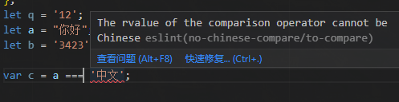

# A plugin to restrict the rvalue of the comparison operator

>example

```js
//.eslintrc.js
module.exports = {
   "plugins": ["no-chinese-compare"], 
   "rules": {
        "no-chinese-compare/to-compare":[
            "error",
            "always"
        ]
    }
}
```

